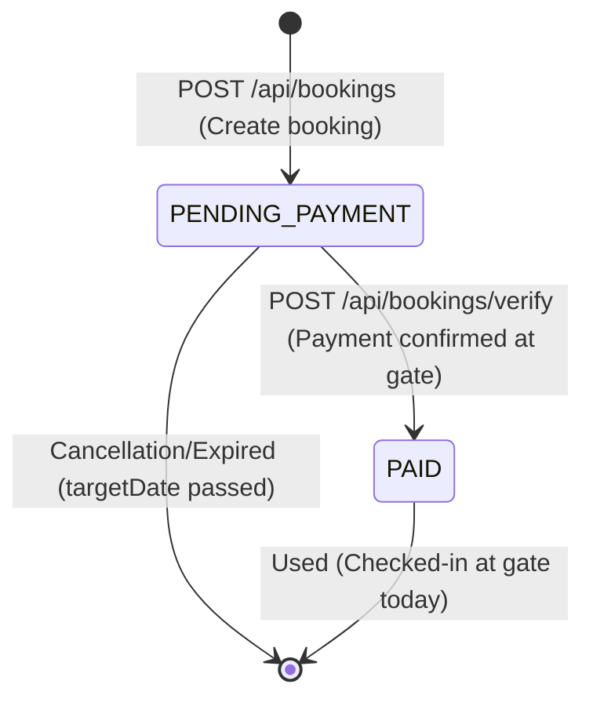

# Data Model Design: Dream Park Ticketing System

## Mongoose Schemas & Data Structures

### 1. User Schema (`User.js`)

Represents all actors in the ecosystem (Visitors, Agents, Admins).

| Field Name | Type | Validation & Rules | Default Value | Notes |
|---|---|---|---|---|
| `name` | String | Required | - | Trimmed |
| `email` | String | Required, Unique, Lowercase | - | Authentication key |
| `password` | String | Required, MinLength 8, Hidden in select | - | Bcrypt hashed pre-save |
| `phoneNumber`| String | Required | - | Contact detail |
| `role` | String | Enum: `['USER', 'MARKETING_AGENT', 'ADMIN']` | `'USER'` | Access control levels |

---

### 2. TicketType Schema (`TicketType.js`)

Represents the product offerings at Dream Park.

| Field Name | Type | Validation & Rules | Default Value | Notes |
|---|---|---|---|---|
| `name` | String | Required, Trimmed | - | Display name (English) |
| `category` | String | Enum: `['INDIVIDUAL', 'GROUP']` | `'INDIVIDUAL'` | Target size category |
| `price` | Number | Required, Min 0 | - | Admission price in EGP |
| `description`| [String] | Array of strings | `[]` | Bulleted features |
| `icon` | String | Required | - | e.g. `'Diamond'`, `'Star'` |
| `color` | String | Required | - | Hex color code |

---

### 3. Booking Schema (`Booking.js`)

Represents a ticket purchase reservation and entry pass.

| Field Name | Type | Validation & Rules | Default Value | Notes |
|---|---|---|---|---|
| `userId` | ObjectId | Required, Ref: `'User'` | - | The booking owner |
| `ticketTypeId`| ObjectId | Required, Ref: `'TicketType'` | - | The associated ticket type |
| `quantity` | Number | Required, Min 1 | `1` | Ticket count |
| `targetDate` | Date | Required | - | The intended date of entry |
| `totalPrice` | Number | Required, Min 0 | - | Price securely calculated on backend |
| `phoneNumber`| String | Required | - | Active mobile number of visitor |
| `qrCodeValue`| String | Required, Unique, UUID v4 | Generated | Ticket identifier |
| `status` | String | Enum: `['PENDING_PAYMENT', 'PAID']` | `'PENDING_PAYMENT'`| Payment state transition |

---

## State Transition Diagram (Booking Lifecycle)

