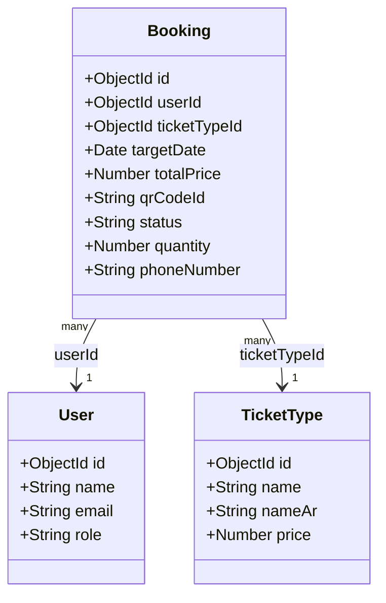

# Data Model Design: Profile Page & Ticket Management

**Feature**: 025-profile-ticket  
**Created**: 2026-05-24  

---

## 1. Schema Modifications

### Booking Model (`BackEnd/src/models/Booking.js`)

The `Booking` model is updated to expand the `status` enum field to support the full lifecycle of a ticket.

```diff
  status: {
    type: String,
-   enum: ['PENDING_PAYMENT', 'PAID'],
+   enum: ['PENDING_PAYMENT', 'PAID', 'USED', 'EXPIRED', 'CANCELLED'],
    default: 'PENDING_PAYMENT',
  },
```

### Full Mongoose Model Structure (As-Built Schema)

```javascript
const bookingSchema = new mongoose.Schema(
  {
    userId: {
      type: mongoose.Schema.ObjectId,
      ref: 'User',
      required: [true, 'Booking must belong to a user'],
    },
    ticketTypeId: {
      type: mongoose.Schema.ObjectId,
      ref: 'TicketType',
      required: [true, 'Booking must belong to a ticket type'],
    },
    targetDate: {
      type: Date,
      required: [true, 'Please specify the target date for the visit'],
    },
    totalPrice: {
      type: Number,
      required: true,
      min: [0, 'Total price cannot be negative'],
    },
    qrCodeId: {
      type: String,
      unique: true,
      default: () => crypto.randomUUID(),
    },
    status: {
      type: String,
      enum: ['PENDING_PAYMENT', 'PAID', 'USED', 'EXPIRED', 'CANCELLED'],
      default: 'PENDING_PAYMENT',
    },
    quantity: {
      type: Number,
      default: 1,
      min: [1, 'Quantity must be at least 1'],
    },
    phoneNumber: {
      type: String,
      required: [true, 'Booking must have a contact phone number'],
      trim: true,
    },
  },
  {
    timestamps: true,
  }
);
```

---

## 2. Model Relations


