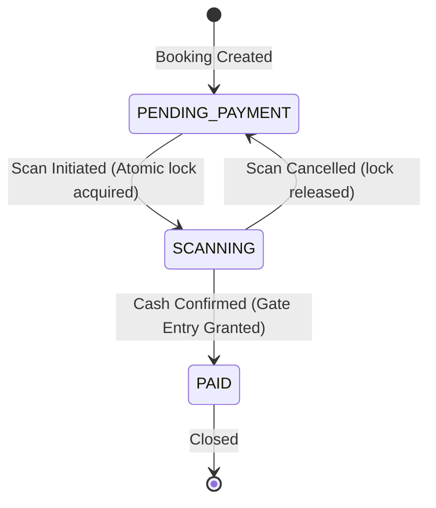

# Data Model Contract: Secure RBAC & Auditing

This document outlines the updates to existing Mongoose schemas and details the new database entities introduced for auditing and secure RBAC verification.

---

## 1. Schema Modifications

### Mongoose Model: `User` (`BackEnd/src/models/User.js`)
We must add the `FINANCIAL_MANAGER` role to the existing enum validator and expand the role normalisation system.

```javascript
// Schema snippet additions
role: {
  type: String,
  enum: ['USER', 'MARKETING_AGENT', 'FINANCIAL_MANAGER', 'ADMIN'],
  default: 'USER',
  uppercase: true,
  trim: true
}
```

### Mongoose Model: `Booking` (`BackEnd/src/models/Booking.js`)
We add a transition lifecycle status schema enforcer. Valid statuses must transition only along permitted paths.

```javascript
// Schema snippet additions
status: {
  type: String,
  enum: ['PENDING_PAYMENT', 'SCANNING', 'PAID'],
  default: 'PENDING_PAYMENT',
  uppercase: true
},
lockedAt: {
  type: Date,
  default: null
},
lockedBy: {
  type: mongoose.Schema.Types.ObjectId,
  ref: 'User',
  default: null
}
```

---

## 2. New Schema Entities

### Mongoose Model: `ScanAuditLog` (`BackEnd/src/models/ScanAuditLog.js`) [NEW]
An append-only database collection capturing gate verification logs.

```javascript
import mongoose from 'mongoose';

const scanAuditLogSchema = new mongoose.Schema({
  agentId: {
    type: mongoose.Schema.Types.ObjectId,
    ref: 'User',
    required: [true, 'Scan event must be associated with an authenticated agent']
  },
  bookingId: {
    type: mongoose.Schema.Types.ObjectId,
    ref: 'Booking',
    required: [true, 'Scan event must reference a target booking']
  },
  actionType: {
    type: String,
    enum: ['SCAN_SUCCESS', 'SCAN_REJECTED_DUPLICATE', 'SCAN_REJECTED_DATE', 'SCAN_CANCELLED'],
    required: [true, 'Audit event must have an action type']
  },
  timestamp: {
    type: Date,
    default: Date.now,
    required: true
  },
  outcome: {
    type: String,
    required: [true, 'Audit log must detail the transaction outcome or error message']
  }
});

// Enforce append-only at MongoDB driver level
scanAuditLogSchema.pre('save', function (next) {
  if (!this.isNew) {
    return next(new Error('ScanAuditLog entries are read-only and cannot be updated.'));
  }
  next();
});

const ScanAuditLog = mongoose.model('ScanAuditLog', scanAuditLogSchema);
export default ScanAuditLog;
```

---

## 3. Permitted State Transition Diagram

